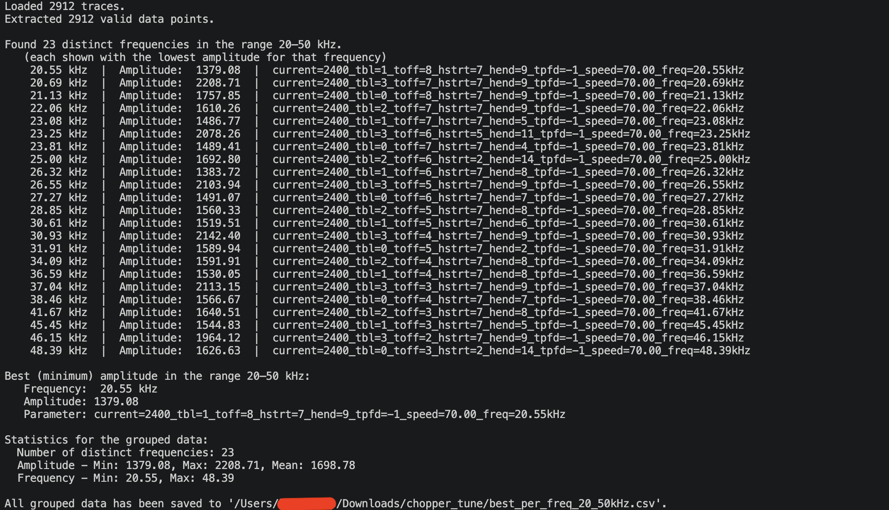
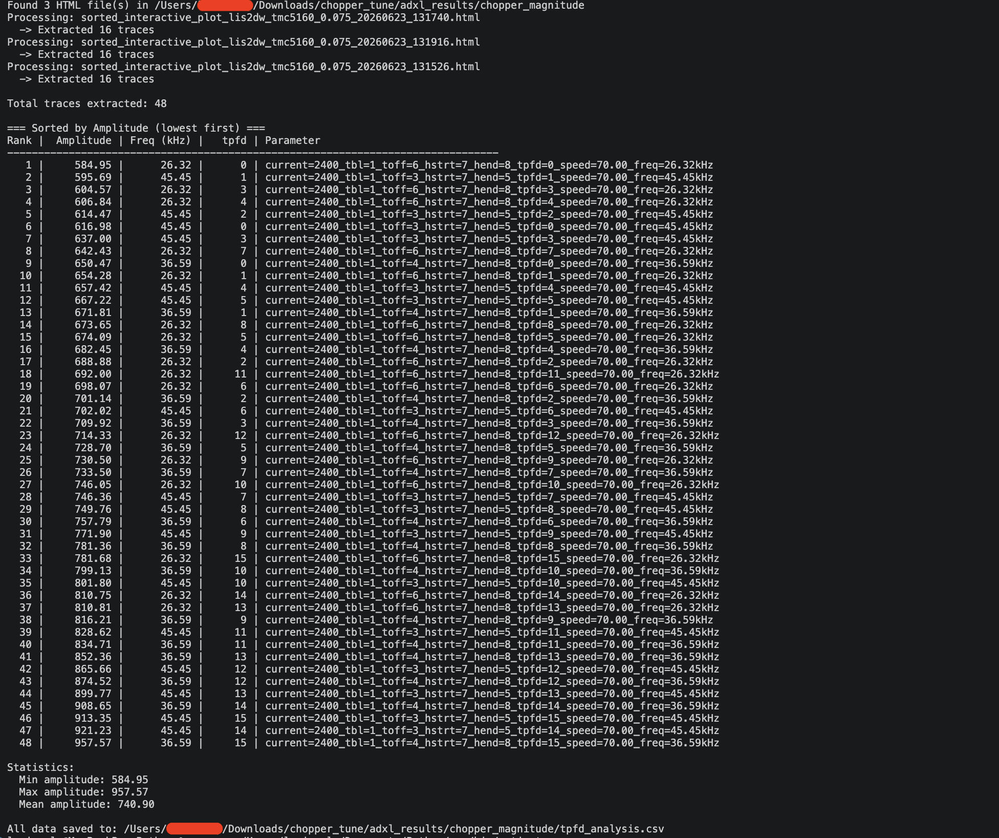

# Chopper Resonance Tuner Analysis Tools

Helper scripts for post-processing and analyzing measurement results generated by the [Chopper Resonance Tuner](https://github.com/MRX8024/chopper-resonance-tuner).

These utilities automatically parse the generated HTML plots, extract measurement traces, and help identify the optimal TMC5160/2160 chopper configuration with the lowest vibration amplitudes.

---

## Overview

The original Chopper Resonance Tuner produces interactive HTML plots containing thousands of measurements.

Manually comparing these datasets can be time-consuming, especially when testing:

- Different chopper frequencies
- Different `tpfd` values
- Multiple TMC register combinations
- Large parameter sweeps

These scripts automate the analysis process and provide a ranked overview of the best-performing settings.

---

## 1. Chopper Tune Extractor

`chopper_tune_extractor.py`

Analyzes a single Chopper Resonance Tuner HTML result file and determines the **best parameter set for each tested chopper frequency**.

### Features

- Extracts trace data directly from the generated HTML file
- Parses frequency and amplitude information
- Filters measurements to a configurable frequency range (20–50 kHz by default, as recommended by Trinamic)
- Groups results by frequency
- Selects the lowest amplitude result for each frequency
- Exports results to CSV
- Prints statistical summaries
- Highlights the overall best frequency

### Example Output

After running `CHOPPER_TUNE FIND_VIBRATIONS=1` and then `CHOPPER_TUNE MIN_SPEED=XX MAX_SPEED=XX`, use this script to analyze the generated `sorted_interactive_plot` and extract the best result for each frequency.



### Typical Use Case

After running a large frequency sweep, this script helps answer:

> Which parameter set produced the lowest vibration amplitude for each tested frequency?

Instead of inspecting thousands of traces manually, the script creates a concise table containing only the best result for every tested frequency.

---

## 2. TPFD Analyzer

`tpfd_analyser.py`

Analyzes a directory containing multiple HTML result files and ranks all measurements by vibration amplitude.

After identifying the best parameter set for each frequency, a few promising candidates can be selected for TPFD optimization and further vibration reduction.

*(The folder should only contain the generated sorted interactive plots for tpfd testing.)*

### Features

- Processes all HTML files inside a folder
- Extracts every valid trace
- Parses:
  - Amplitude
  - Chopper frequency
  - TPFD value
  - Complete parameter string
- Sorts all measurements by amplitude
- Generates a ranked list
- Exports results to CSV
- Calculates basic statistics

### Example Output

After running step 1, we decide on three promising parameter sets to test further. These are:

`current=2400_tbl=1_toff=6_hstrt=7_hend=8_tpfd=-1_speed=70.00_freq=26.32kHz`

`current=2400_tbl=1_toff=4_hstrt=7_hend=8_tpfd=-1_speed=70.00_freq=36.59kHz`

`current=2400_tbl=1_toff=3_hstrt=7_hend=5_tpfd=-1_speed=70.00_freq=45.45kHz`

We run each of them with a command similar to the following example for the first parameter set:

`CHOPPER_TUNE TBL_MIN=1 TBL_MAX=1 TOFF_MIN=6 TOFF_MAX=6 HSTRT_MIN=7 HSTRT_MAX=7 HEND_MIN=8 HEND_MAX=8 TPFD_MIN=0 TPFD_MAX=15 MIN_SPEED=70 MAX_SPEED=70 ITERATIONS=2`

*(Adjust the values to match your selected parameter set.)*



### Typical Use Case

After generating multiple resonance sweeps with different TPFD values, the script helps answer:

> Which TPFD setting consistently produces the lowest vibration amplitudes across multiple measurements?

> Is there a higher chopper frequency that provides a more pleasant acoustic signature while maintaining the same vibration level? (This aspect is often overlooked.)

The analyzer combines all measurements into a single sortable dataset and immediately reveals the best-performing configurations.

---

## Workflow

```text
CHOPPER_TUNE FIND_VIBRATIONS=1
                │
                ▼
      Determine Resonance Speed
                │
                ▼
CHOPPER_TUNE MIN_SPEED=XX MAX_SPEED=XX
                │
                ▼
     sorted_interactive_plot.html
                │
                ▼
      chopper_tune_extractor.py
                │
                ▼
    Best Result per Frequency
                │
                ▼
 Select Several Promising Candidates
                │
                ▼
      TPFD Sweep Measurements
                │
                ▼
          tpfd_analyser.py
                │
                ▼
    Optimal Chopper Configuration
```

---

## Output Files

### Chopper Tune Extractor

Generates:

```text
best_per_freq_20_50kHz.csv
```

Columns:

```text
Frequency_kHz
Min_Amplitude
Parameter
```

---

### TPFD Analyzer

Generates:

```text
tpfd_analysis.csv
```

Columns:

```text
Rank
Amplitude
Frequency_kHz
tpfd
Parameter
```

---

## Requirements

- Python 3.8+
- Standard library only

No additional dependencies are required.

---

## Disclaimer

These scripts are not part of the original Chopper Resonance Tuner project.

They are post-processing utilities intended to simplify the analysis of large resonance tuning datasets and accelerate the search for optimal TMC chopper settings.
